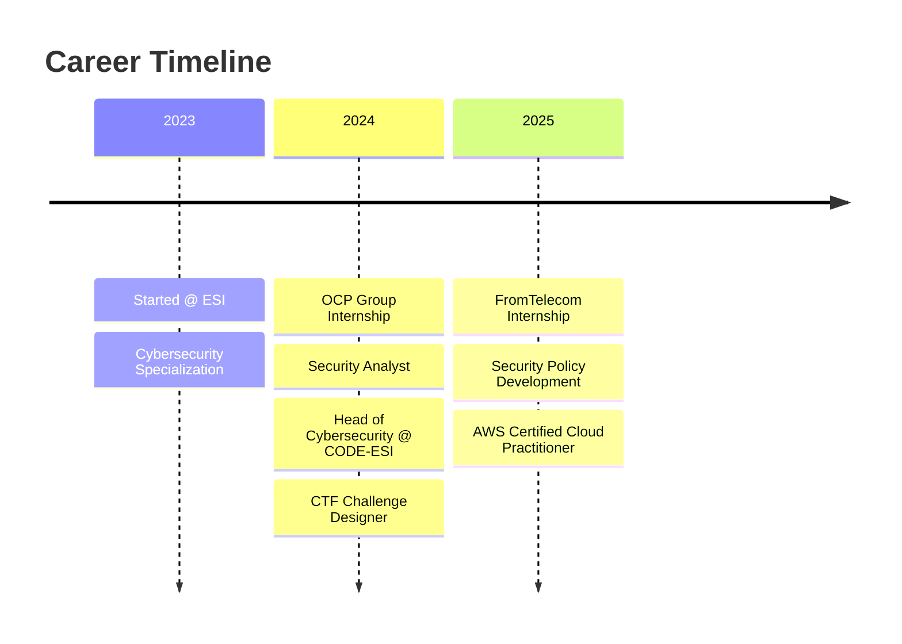

<div align="center">


[](https://git.io/typing-svg)

<p align="center">
  <a href="https://www.linkedin.com/in/ashraf-abiba-836820207/"></a>
  <a href="mailto:achraf.abiba@esi.ac.ma"></a>
  <a href="https://github.com/Tekila11"></a>
  
</p>

</div>

---

## 🎯 About Me

<table>
<tr>
<td width="55%" valign="top">

### 👨‍💻 Who Am I?

Hey there! I'm **Achraf Abiba**, a passionate **Cybersecurity Engineering student** at **ESI (École Supérieure d'Informatique)** in Morocco 🇲🇦. I specialize in **Information Systems Security & Cyberdefense**, with a deep focus on building secure, resilient systems.

As **Head of Cybersecurity at CODE-ESI Club**, I lead a team of security enthusiasts, organizing workshops, developing CTF challenges, and fostering a culture of defensive security. My journey has taken me from security assessments at major enterprises to designing challenges for international CTF competitions.

```python
class CybersecurityEngineer:
    def __init__(self):
        self.name = "Achraf Abiba"
        self.current_role = "Head of Cybersecurity @ CODE-ESI"
        self.education = "Security Engineering @ ESI"
        self.location = "Rabat, Morocco 🇲🇦"

    def expertise(self):
        return {
            "security": ["Penetration Testing", "Network Defense",
                        "Security Policy Development", "Vulnerability Assessment"],
            "blockchain": ["Smart Contracts", "DApp Development",
                          "Ethereum", "Solidity"],
            "systems": ["Linux Administration", "Cloud Security",
                       "Containerization", "Infrastructure Hardening"],
            "other": ["CTF Design", "Security Research", "Teaching"]
        }

    def current_focus(self):
        return [
            "🔐 Advanced Penetration Testing & Red Teaming",
            "⛓️ Blockchain Security & Smart Contract Auditing",
            "☁️ Cloud Security Architecture (AWS)",
            "🚩 CTF Challenge Creation & Security Education"
        ]

    def achievements(self):
        return {
            "internships": ["OCP Group", "FromTelecom"],
            "ctf_designer": ["Cyber Warfare Odyssey", "Season of Secrets"],
            "certifications": ["AWS Cloud Practitioner", "Cisco Ethical Hacker"],
            "leadership": "Head of Cybersecurity @ CODE-ESI Club"
        }

me = CybersecurityEngineer()
print(f"👋 {me.name} here! Building secure systems, one line of code at a time.")
```

</td>
<td width="45%" valign="top">

### 🚀 What I Do


#### 🔐 Security & Defense
- **Penetration Testing**: Network security assessments, vulnerability analysis
- **Policy Development**: NIST CSF 2.0 & ISO 27001 compliance frameworks
- **CTF Design**: Creating educational security challenges for global competitions
- **Security Research**: Exploring cutting-edge defensive techniques

#### ⛓️ Blockchain Development
- **Smart Contracts**: Solidity development for decentralized applications
- **DApp Architecture**: Building secure blockchain-based systems
- **Security Auditing**: Analyzing smart contract vulnerabilities

#### 🐧 Linux & DevOps
- **System Hardening**: Advanced Arch Linux configurations (Hyprland enthusiast!)
- **Infrastructure**: Docker, Kubernetes, LDAP, virtualization
- **Automation**: Shell scripting, workflow optimization

#### 🎓 Teaching & Mentorship
- Leading **CODE-ESI** cybersecurity initiatives
- Organizing hands-on security workshops
- Mentoring students in ethical hacking & secure coding
- Developing practical labs for defensive security

---

### 💼 Quick Stats

```yaml
🎯 Current Position: Head of Cybersecurity @ CODE-ESI Club
📚 Education: Security Engineering Student @ ESI (2023-2026)
🌍 Location: Rabat, Morocco
💼 Experience: OCP Group | FromTelecom
🏆 CTF Designer: International Competitions
🎓 Certifications: AWS | Cisco Ethical Hacker
🔍 Focus Areas: Pentesting | Blockchain | Cloud Security
```

</td>
</tr>
</table>

---

## 🔥 Featured Projects

<div align="center">

<table>
<tr>
<td width="50%" valign="top">

### 🔐 [secVlog](https://github.com/Tekila11/secVlog)


**Cybersecurity video blogging platform** for sharing security research, tutorials, vulnerability analysis, and defensive security practices. Educational content for the security community.

**Stack:** `HTML` `CSS` `JavaScript`

🔗 **Focus:** Security Research | Tutorials | Vulnerability Analysis

</td>
<td width="50%" valign="top">

### 🎓 [CODE-ESI Projects](https://github.com/Tekila11/ESI)


**Educational security resources** from CODE-ESI club initiatives. Comprehensive collection of hands-on labs, CTF challenges, and security workshops for student learning.

**Stack:** Multi-language educational resources

🔗 **Focus:** CTF Challenges | Security Labs | Workshops

</td>
</tr>

<tr>
<td width="50%" valign="top">

### 🎨 [Tekila Hyprland Dots](https://github.com/Tekila11/Tekila-hyprland-dots)


⭐ **1 Star**

**Custom Hyprland configuration** showcasing advanced window manager customization, workflow optimization, and aesthetic ricing for Arch Linux power users.

**Stack:** `Shell Scripts` `Config Files` `Waybar`

🔗 **Focus:** Linux Customization | Workflow | Aesthetics

</td>
<td width="50%" valign="top">

### ⛓️ [Blockchain Voting App](https://github.com/Tekila11/Blockchain-Voting-App)


**Decentralized voting DApp** built on Ethereum. Secure, transparent, and tamper-proof voting system using smart contracts demonstrating blockchain's real-world applications.

**Stack:** `Solidity` `React` `Web3.js` `Ethereum`

🔗 **Focus:** Smart Contracts | DApp | Blockchain Security

</td>
</tr>
</table>

</div>

---

## 💻 Tech Arsenal

<div align="center">

### 🔒 Security & Penetration Testing


### 📋 Compliance & Frameworks


### 🖥️ Operating Systems & Infrastructure


### 🐳 Containerization & Orchestration


### ⛓️ Blockchain & Web3


### 💻 Programming & Development


### ☁️ Cloud & DevOps


### 🗄️ Databases & Directory Services


</div>

---

## 📊 GitHub Analytics

<div align="center">
  
  
</div>

<div align="center">
  
</div>

<div align="center">
  
</div>

---

## 🏆 Professional Journey

<div align="center">



</div>

### 🔐 FromTelecom - Cybersecurity Policy Development Intern
**📅 Aug – Sep 2025**
- 📋 Developed comprehensive **information security policy v1** with **28 structured policies** covering all NIST CSF 2.0 functions
- ✅ Conducted comparative analysis of industry security policies
- 🎯 Aligned organizational practices with **NIST CSF 2.0** and **ISO/IEC 27001** standards
- 📄 Prepared foundational documentation for future ISO certification

### 🛡️ OCP Group - Cybersecurity Analyst Intern
**📅 Aug – Sep 2024**
- 🔍 Conducted comprehensive security assessment of OCP Group's enterprise infrastructure
- 🎯 Evaluated **OPM**, **IPAN**, **ERP**, and **FMS** systems
- 📊 Identified critical vulnerabilities and security gaps
- 📝 Delivered detailed audit report with prioritized remediation strategies

### 🎯 CODE-ESI Club - Head of Cybersecurity
**📅 2024 – Present**
- 👥 Lead cybersecurity team in educational initiatives and workshops
- 🎓 Organize training sessions on ethical hacking, secure coding, and defensive security
- 🚩 Develop practical labs and CTF challenges for hands-on learning
- 🌍 Mentor students in cybersecurity career development

---

## 🎖️ CTF & Competitions

<div align="center">

### 🏅 Challenge Designer - Cyber Cohesion Collaboration
**2024 – 2025**

<table>
<tr>
<td align="center" width="33%">
<br/>
<b>Cyber Warfare Odyssey</b><br/>
International CTF Competition<br/>
<i>Cryptography | Web Security</i>
</td>
<td align="center" width="33%">
<br/>
<b>Season of Secrets</b><br/>
Global Security Challenge<br/>
<i>OSINT | Forensics</i>
</td>
<td align="center" width="33%">
<br/>
<b>Educational Impact</b><br/>
Reaching Global Audience<br/>
<i>Security Awareness</i>
</td>
</tr>
</table>

**Challenge Categories:**
- 🔐 Cryptography
- 🌐 Web Security
- 🔍 OSINT (Open Source Intelligence)
- 💾 Digital Forensics

</div>

---

## 🎓 Certifications & Credentials

<div align="center">

| 🏆 Certification | 🏢 Issuer | 📅 Year | 🔗 Badge |
|-----------------|----------|---------|----------|
| **AWS Certified Cloud Practitioner (CLF-C02)** | Amazon Web Services | 2025 | ☁️ |
| **Ethical Hacker** | Cisco Networking Academy | 2024 | 🔐 |
| **Introduction to Cybersecurity** | Cisco Networking Academy | 2023 | 🛡️ |
| **Authentication and Authorization with AWS IAM** | Amazon Web Services | 2024 | 🔑 |
| **Agile Project Management** | HP LIFE | 2024 | 📊 |

</div>

---

## 🎯 Key Projects & Initiatives

<details>
<summary><b>🏢 Enterprise Infrastructure Project</b> (Oct 2024 – Jan 2025)</summary>
<br/>

**Systems & Network Administration**
- ⚙️ Configured **OpenLDAP** directory services for centralized authentication
- 💻 Implemented **Windows Deployment Services (WDS)** with PXE boot
- 📊 Set up **SysLog/NTP** monitoring infrastructure
- 🖥️ Deployed **Hyper-V virtualization** environment
- 🔒 Applied security hardening and best practices

</details>

<details>
<summary><b>📡 TIPE PROJECT: MEC & 5G</b> (2021 – 2023)</summary>
<br/>

**Research Project - CPGE**
- 📚 Investigated **Mobile Edge Computing (MEC)** architecture and applications
- 📶 Studied **5G technology** and its security implications
- 🔬 Conducted comprehensive research for end-of-study project
- 📊 Presented findings on network optimization and edge security

</details>

---

## 🎓 Education

<div align="center">

| 🏫 Institution | 📚 Program | 📅 Period |
|---------------|-----------|----------|
| **ESI - École Supérieure d'Informatique** | Information Systems Security Engineering & Cyberdefense | 2023 – 2026 |
| **CPGE - Classes Préparatoires** | MP (Mathematics & Physics) | 2021 – 2023 |

</div>

---

## 🌐 Let's Connect & Collaborate!

<div align="center">


### 💬 Open to Collaboration On:
```
🔐 Cybersecurity Research  |  🚩 CTF Competitions  |  ⛓️ Blockchain Projects
🛡️ Defensive Security Tools  |  🐧 Linux Customization  |  📚 Security Education
```

<br/>

<a href="https://www.linkedin.com/in/ashraf-abiba-836820207/">
  
</a>
<a href="mailto:achraf.abiba@esi.ac.ma">
  
</a>
<a href="https://github.com/Tekila11">
  
</a>

<br/><br/>

**📍 Based in Rabat, Morocco** | **☎ +212 610899379**

</div>

---

<div align="center">

### 💡 Security Philosophy

> *"Security is not a product, but a process. It's a way of thinking, a methodology that must be applied continuously."*
>
> **— Bruce Schneier**

<br/>

### 🎯 Current Focus Areas


<br/>

**Thanks for visiting! Feel free to explore my repositories and reach out for collaboration! 🚀**


</div>
